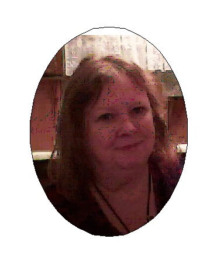
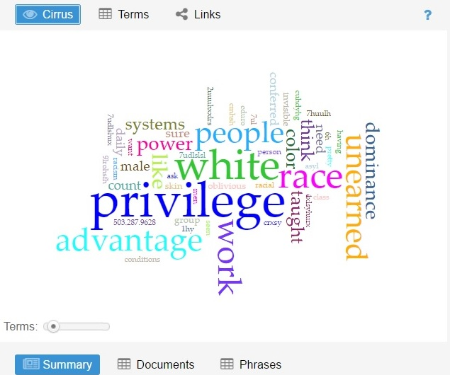
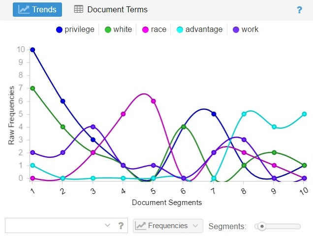

#  IASC 2P02 | [Joyce Rustenburg](https://twitter.com/rustenburg_J)

## About me

- I am a third-year student in Interactive Arts and Science at [Brock University] (https://brocku.ca/humanities/humanities-research/humanities-research/humanities-research-institute), in the Centre for Digital Humanities. I am studying solving problems through Interactive Arts and Science. Previously my studies included Computer Science (2003), Honours Sociology with a concentration in Social Justice and Equity (2010), Honours Women’s and Gender Studies (2015). These disciplines have provided tools and lenses for analysis from hard science and soft science perspectives as well as feminist perspectives.

- I first worked in UNIX when I was the help desk for a free net in the mid 1990s. The Internet was non-graphical at first and I worked using the command line to add users to the system, make help files to instruct business and residential clients. I configured how to connect to the Internet with various computers, modems, and software, and how to use/surf non-graphical Internet programs such as Archie, Veronica, and Lynx. I prorammed at the Windows command line (DOS) since 1988 and in Java since 1997 at school and on my G5 Powerbook, Macbooks, and Windows OS. I also use my two Linux OS computers.

- My interests are social justice and equity, programming, Arduino, and I have a You Tube gaming channel. I volunteer making meals, serving and cleaning up for a Saturday Lunch Program in my community for low income and homeless people.

## Assignment 2

I refer to the article ["Why are the Digital Humanities so White?"](http://dhdebates.gc.cuny.edu/debates/text/29) by Tara McPherson who asks this question. She addresses two groups, technological and from the humanities who are or seem to be in different camps or silos in 'the academy' and who have different audiences. To discuss this question she draws a parallel between the UNIX operating system and media and race, to demonstrate looking through a lenticular lens. This lens type can show one image, or the other, but not both images at the same time or a merged version, e.g., her example of a postcard of two 3-D images. Her parallel structure is good for comparison as she talks about one concept, then the other, to compare how they bound their respective entities first in the mid 1960s and then much later on. McPherson's article is helpful to explain the point of view to each group from the perspective of the other group.

> Both the computer and the lenticular lens mediate images and objects, changing their relationship but frequently suppressing that process of relation, much like the divided departments of the contemporary university. The fragmentary knowledges encouraged by many forms and experiences of the digital neatly parallel the logics that underwrite the covert racism endemic to our times, operating in potential feedback loops, supporting each other. If scholars of race have highlighted how certain tendencies within poststructuralist theory simultaneously respond to and marginalize race, this maneuver is at least partially possible because of a parallel and increasing dispersion of electronic forms across culture, forms that simultaneously enact and shape their new modes of thinking (13). (Thomas Rommel)  (http://www.digitalhumanities.org/companion/view?docId=blackwell/9781405103213/9781405103213.xml&chunk.id=ss1-2-8&toc.depth=1&toc.id=ss1-2-8&brand=default)

### Article Analysis, A Parallel Structure of UNIX and Race

Unix and race are separate entities which McPherson looks at through a lenticular lens. She uses a parallel structure to explain why the digital humanities are so white. 

- Structural separation

1. About UNIX. UNIX _embeds information_, hiding it from users of the system but transparent to creators of applications. The application programmers cordon off users from areas of the program they do not want users to see or access or change. It does so by modularity and use of shells.

2. About RACE. Our bodies _embody information_ such as race and culture. Judgements are made, e.g., by media, employers, according to visual representations. According to a structured hierarchy of white / other, where 'white' may be or is preferred and 'other' may or is not. The other are cordoned off and prevented from accessing jobs, services and/or programs that owners/managers of the system do not want them to access. 

3. A supporting document to McPherson, is Peggy McIntosh's _White Privilege, Unpacking the Invisible Knapsack_  (https://www.pcc.edu/resources/illumination/documents/white-privilege-essay-mcintosh.pdf) outlines the 
"_Privilege: an invisible package of unearned assets that I can count on cashing in each day, but about which I was “meant” to remain oblivious"_. McIntosh writes a numbered list advantages of being white that come implicitly in an 'invisible knapsack' that she has taken for granted as a white person. She shines a spotlight on the white privilege that most [whites] take for granted and do not notice.

4. Why were the digital humanities so white, sheds light on why are the 1% still so white? The system supports itself, 'the master's tools' are white, the system, as McPherson points out, is structured so that it feeds the white and stifles the other, first overtly before the mid 1960s then covertly after that. White, upper class, educated men have the privilege to continue the system. In the mid 1960s there were race riots and the second wave of feminism to counter act that system of privilege. This is a political subject as those who controlled the Internet and early computers were the government and the military. The government still controls schools and education. Who controls the media and networks but corporations who pay for air time through commercials and advertisements. Who controlled the government, education, and corporations but white, upper class, educated men.

5. Changes came about from second wave feminism, to work toward gender equality and third wave feminism in the early 1990s brought many aspects including action and support for women of colour. Feminism could push back against inequity. People had to recognize inequity and that is why I have included Peggy McIntosh's paper on _White Privilege, Unpacking the Invisible Knapsack._ The goal is to break down the barriers to allow inclusion in the Digital Humanities, academia, or elsewhere.

#### Pre UNIX

i studied assembly language on a Von Neumann machine/processor, with do-it-yourself data structures carved out, with SAL, MAL, and TAL (True Assembly Language). One could argue that programming in assembly was complicated in that it required keeping track of the space used, being careful not to overwrite areas by keeping the data structures in the program 'segregated' manually in the program. One could also argue that it was simple, transparent, and hands-on.

#### UNIX and mid 1960s

The operating system Unix overtook Von Neumann's machine programmed with asssembly language. UNIX had shells and used modularity, making it less open and accessible than previous opreating systems programmed with assembly language. 

  **Unix**   |        **Race**
  ------ | -----------------------------
  modular |  overt racism
  shell   |  segregation

#### Late 1990s

**Unix, Java** |       **Race**
------------ | --------------------------------
modular |  covert racism
OOP |  feedback loops further racism

Structures responding to and marginalizing race - feminism, there is no one woman's story, but many stories, the one/the other and the question is "Who benefits?" and difference, the other always in relation to the one, but the other can never be 'the one.' Previous to this was the male as bread winner, vs. the 'person of colour' male bread winner.

### Voyant Text Analysis

As Thomas Rommel writes, 
> The history of literary computing, however, shows that only a limited number of textual phenomena can be analyzed profitably in the context of quantitative and qualitative computer-based analyses of style. These phenomena have to be linked to some surface features that can be identified by electronic means, usually by some form of pattern matching. Computers are exceptionally well suited for this kind of analysis, and only human intuition and insight, in combination with the raw computing power of machines programmed to act as highly specialized electronic tools, can make some texts or textual problems accessible to scholars.

Cite as: A Companion to Digital Humanities, ed. Susan Schreibman, Ray Siemens, John Unsworth. Oxford: Blackwell, 2004. 
http://www.digitalhumanities.org/companion/

An example:
This text analysis visualization, presents evidence that supports my core argument. 
The text analysis tool I used was [Voyant](https://voyant-tools.org). Here is the text analysis document window after I pasted in the text from the article, 
. The results of the text analysis: This corpus has 1 document with 10,231 total words and 2,581 unique word forms. Created now.
Most frequent words in the corpus: unix (74); digital (62); race (52); modularity (40); new (37).
- In the word map of the text the size of the text is in direct proportion to the number of times the word is found in the corpus.
The corpus, or the text in the document is shown between the word map and the graph. The curves in the graph show the analysis of the word count of the corpus, the article by McPherson.
Following is the Voyant text analysis of Peggy McIntosh's article.

### Voyant Text Analysis of Peggy McIntosh's _White Privilege_

This corpus has 1 document with 2,566 total words and 796 unique word forms. Created 2 seconds ago.
Most frequent words in the corpus: privilege (31); white (22); race (18); advantage (15); work (15)

  **McPherson - Word cloud**   |        **McIntosh**
  ------ | -----------------------------
  overt and covert racism |  white privilege sustains racism
     |  

  **McPherson - Graph**   |        **McIntosh**
  ------ | -----------------------------
  overt and covert racism |  white privilege sustains racism
     |  
  
  
  Link to [blog](https://rustenburgj.github.io/IASC-2P02/blog).

Works Cited

McIntosh, Peggy. "White Privilege: Unpacking the Invisible Knapsack" https://www.pcc.edu/resources/illumination/documents/white-privilege-essay-mcintosh.pdf accessed March 3, 2017. From 
McIntosh, Peggy. White Privilege and Male Privilege: A Personal Account of Coming to See Correspondences Through Work in Women's Studies. Wellesley, MA: Wellesley College, Center for Research on Women, 1988. Print.

McPherson, Tara. 2012 Print Edition. “Why Are the Digital Humanities So White? or Thinking the Histories of Race and Computation”  http://dhdebates.gc.cuny.edu/debates/text/29 accessed March 3, 2017.

(Thomas Rommel)  (http://www.digitalhumanities.org/companion/view?docId=blackwell/9781405103213/9781405103213.xml&chunk.id=ss1-2-8&toc.depth=1&toc.id=ss1-2-8&brand=default)

Reference
[digital humanities companion](http://www.digitalhumanities.org/companion/)
