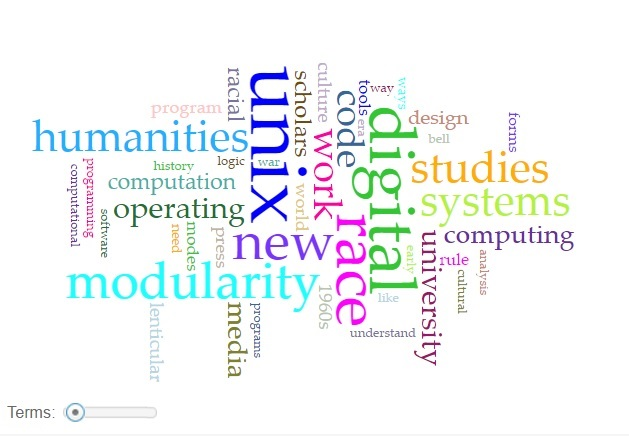
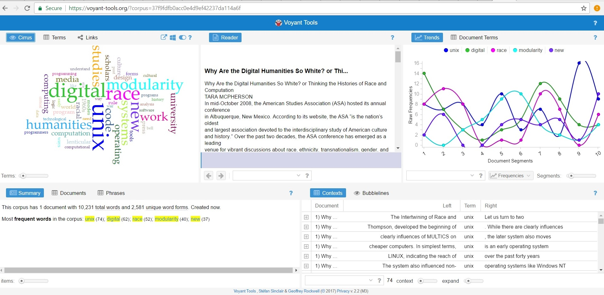

#  Blog

# Joyce Rustenburg

## Assignment 2

Temporary Blog

I refer to the article "Why are the Digital Humanities so White?" by McPherson who discusses a parallel between hard sciences and ditial humanities using Unix and race looking through a lenticular lens which can show one image, or the other, but not both images at the same time or a merged version, e.g., a postcard of two 3-D images. 

Both the computer and the lenticular lens mediate images and objects, changing their relationship but frequently suppressing that process of relation, much like the divided departments of the contemporary university. The fragmentary knowledges encouraged by many forms and experiences of the digital neatly parallel the logics that underwrite the covert racism endemic to our times, operating in potential feedback loops, supporting each other. If scholars of race have highlighted how certain tendencies within poststructuralist theory simultaneously respond to and marginalize race, this maneuver is at least partially possible because of a parallel and increasing dispersion of electronic forms across culture, forms that simultaneously enact and shape their new modes of thinking (13).

This text analysis visualization, presenting evidence that supports your core argument is taken from Voyant included here as a static image (not as an embedded html snippet).

This corpus has 1 document with 10,231 total words and 2,581 unique word forms. Created now.
Most frequent words in the corpus: unix (74); digital (62); race (52); modularity (40); new (37)

[link to Brock University](https://brocku.ca/humanities/humanities-research/humanities-research/humanities-research-institute)

The text analysis tool I used was Voyant. Here is the text analysis document window. 

Link to Blog: 

